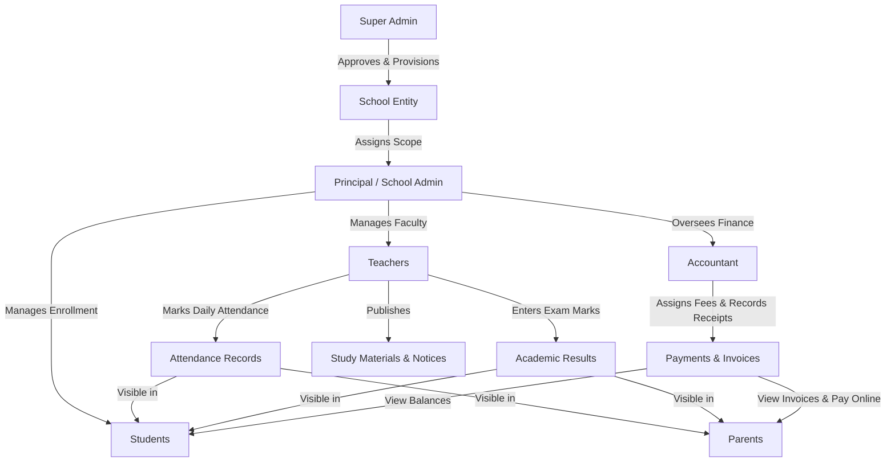

# METHQAL TECH — COMPLETE WORKFLOW SPECIFICATION & ROLE DATA FLOWS
**Platform:** Methqal Tech School Management System (منصة مثقال تك لإدارة المدارس الذكية)  
**Architecture:** Next.js App Router, Prisma ORM, SQLite (`dev.db`), Tailwind CSS  

---

## 1. End-to-End Customer Journey & School Onboarding

### Phase 1: Visitor Discovery & Application
1. **Public Homepage (`/`):** Prospective institutions view features, pricing tiers (Basic, Pro, Enterprise), and platform capabilities.
2. **Accessing Application:** Visitor clicks **Login** (`/login`) -> clicks **"Apply for a New School"** (`/login/apply`).
3. **Form Completion:**
   - Institution Name (`schoolName`)
   - Administrator Full Name (`adminName`)
   - Professional Email (`email`)
   - Phone Number (`phone`)
   - Registry/License Code (`instituteCode`) [Optional]
   - Administrative Password (`password`)
   - Message & Capacity Requirements (`message`) [Optional]
4. **Server Validation & Security:**
   - Server-side format checks (Email format regex, phone regex, minimum lengths).
   - Duplicate prevention: rejects emails already registered as active system users or already awaiting review.
   - Plaintext passwords are **never** stored. Passwords are encrypted using salted `bcrypt` hashes (`passwordHash`).
   - Generation of unique reference identifier: `APP-YYYY-XXXXX`.
5. **Database Persistence:**
   - Record created in `SchoolApplication` table with status `PENDING`.
6. **Truthful Success Confirmation:**
   - Displays clear reference badge with reference number.
   - Explains that the application has been received into the central database and is awaiting Super Admin evaluation.
   - Provides direct actions to return to login or homepage.

---

### Phase 2: Super Admin Evaluation & Inbox
1. **Inbox Route:** `/dashboard/super-admin/applications`
2. **Authentication:** Enforces server-side guard `useRoleGuard("super_admin")` and `getCurrentUser()`. Unauthorized users are rejected.
3. **Filtering & Search:** Super Admin filters by `PENDING`, `UNDER_REVIEW`, `APPROVED`, `REJECTED`, or searches by keyword.
4. **Detail Review:** Clicking an application opens the inspection drawer displaying applicant contact details, institution code, submission timestamp, and message.

---

### Phase 3: Approval Workflow & Entity Provisioning
When the Super Admin approves an application:
1. **Atomic Transaction (`prisma.$transaction`):**
   - **School Provisioning:** Creates new `School` record with a unique URL slug (e.g. `al-qimma-4921`), name, contact email, phone, and registration ID.
   - **Administrator Account Provisioning:** Creates `User` record with role `"admin"`, links `schoolId` to the newly created school, activates status, and stores the applicant's bcrypt hashed password.
   - **Academic Setup:** Seeds default class structures (`Class 1`, `Class 2`) for the school.
   - **Application Finalization:** Updates `SchoolApplication` status to `APPROVED`, timestamps `reviewedAt`, records `reviewedBy` (Super Admin), and assigns `schoolId`.
2. **Cache Revalidation:** Automatically revalidates `/dashboard/super-admin/applications`, `/dashboard/super-admin/schools`, and `/schools`.
3. **Duplicate Protection:** Blocks re-approval if application status is already `APPROVED`.

---

### Phase 4: Rejection Workflow
When the Super Admin declines an application:
1. **Mandatory Justification:** Prompts for review notes/rejection reason.
2. **Persistence:** Sets status to `REJECTED`, records `reviewNotes`, reviewer ID, and timestamp.
3. **Audit Trail:** Application remains permanently visible in the "Rejected" tab for regulatory record-keeping.

---

## 2. Six Platform Roles & Intra-Role Data Flows

---

### 1. Super Admin Role
- **Access Route:** `/dashboard/super-admin`
- **Capabilities:**
  - Review, approve, and reject school applications.
  - Manage all provisioned schools and institutional settings.
  - Create and manage platform subscription plans.
  - Platform-wide transaction ledger and revenue statistics.
  - System-wide support tickets and user directory.

---

### 2. Principal / School Admin Role
- **Access Route:** `/dashboard/principal`
- **Scope:** Bound strictly to `schoolId` assigned upon approval.
- **Capabilities:**
  - Institutional student information system (SIS): admissions, profiles, and sections.
  - Teacher roster: hiring, department allocation, and subject assignments.
  - Class and section structure management.
  - Institution-wide announcements and attendance oversight.
  - School financial summaries and plan subscription management.

---

### 3. Teacher Role
- **Access Route:** `/dashboard/teacher`
- **Scope:** Assigned classes and subjects within their school.
- **Capabilities:**
  - Class rosters for assigned subjects.
  - Daily attendance recording (Present, Absent, Late).
  - Exam results and mark entry (Midterm, Final) linking to `Exam` and `Subject`.
  - Upload learning materials (PDF, notes) accessible to assigned students.
  - Teacher notices and student feedback.

---

### 4. Student Role
- **Access Route:** `/dashboard/student`
- **Scope:** Individual student record linked to authenticated user.
- **Capabilities:**
  - Personal academic timetable and daily attendance calendar.
  - Published marks, grades, and report cards.
  - Download assigned study materials.
  - View fee invoices and submit student tuition payments via PaymentFlow.

---

### 5. Parent Role
- **Access Route:** `/dashboard/parent`
- **Scope:** Strictly scoped to children linked via `ParentStudent` relational mapping (e.g. Omar and Sarah for demo parent `parent@methqal.tech`).
- **Capabilities:**
  - Switch between multiple enrolled children.
  - Child-specific daily attendance records and interactive policy modal.
  - Leave request submission form with administrative tracking.
  - Comprehensive report cards with CSV export capabilities.
  - View school announcements and interactive notice detail modal.
  - Tuition fee history and payment status tracking.

---

### 6. Accountant Role
- **Access Route:** `/dashboard/accountant`
- **Scope:** School-level financial transactions.
- **Capabilities:**
  - Tuition fee configuration by class tier.
  - Student outstanding balances and due lists.
  - Record cash/bank receipts (`Payment` model with status `SUCCESS`).
  - Institutional expense tracking (`Expense` model: salaries, equipment, maintenance).
  - Financial cashflow and balance reports.

---

## 3. Data Integrity & Authorization Guarantees

1. **Server-Side Role Guarding:** Route access is validated both on the client via `useRoleGuard` and on the server via `getCurrentUser()` and HTTP cookies.
2. **Relational Isolation:** Students only view their own records; parents only view linked children; teachers cannot edit marks outside their assigned subjects; school admins cannot read other schools' databases.
3. **Session Persistence:** Offline local demo operates via HTTP-only cookie `auth_session` and client-accessible `methqal_role`, ensuring instant SSR hydration and offline reliability.
